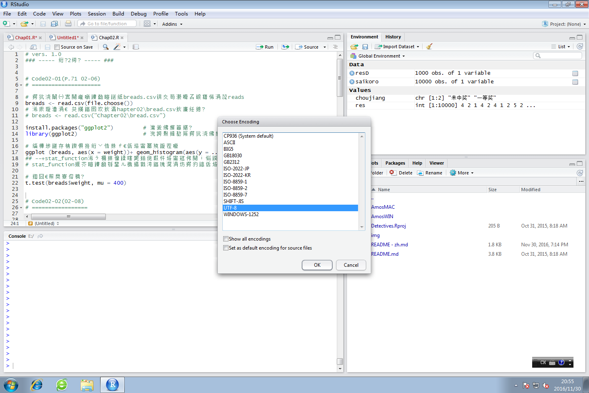
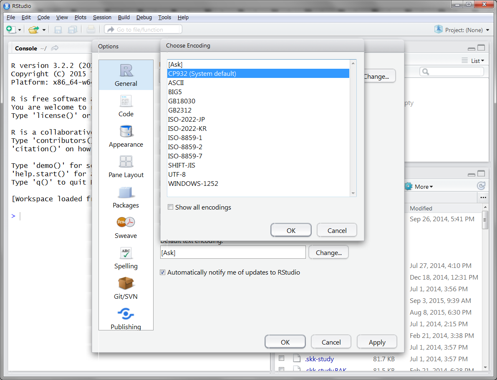

菜鸟侦探 挑战数据分析
===================

本书涉及的数据和R脚本文件存放在该目录中。请各位根据使用的操作系统从AmosMac和AmosWIN两个文件夹中选择其一，这两个文件夹中保存有已按照章节分好的子文件夹。

## Prepare.R文件

该文件用于一次性安装本书涉及的所有程序包。

## R脚本文件在RStudio中显示为乱码

若R脚本文件（特别是在Windows下）打开后显示为乱码，请尝试以下解决方法：

* 从窗口顶部的菜单中选择File -> Reopen with Encoding，然后在弹出的对话框中选择相应的字符编码并点击“OK”确认。

 - Windows __UTF-8__
 - Mac __UTF-8__

* 从窗口顶部的菜单中选择Tools -> Global Options（Windows）或Preferences（Mac），然后在弹出的对话框中点击左侧的__General__，接着点击右下方__Default text encoding:__后面的__Change...__按钮，最后从弹出的对话框中选择相应的字符编码并点击“OK”确认。

 - Windows __UTF-8__
 - Mac __UTF-8__

## 数据文件的路径

本书中通过`read.csv()`函数加载数据文件时使用的多为相对路径，因此若执行代码后遇到如下错误信息：

> Error in file(file, "rt") : cannot open the connection
> In addition: Warning message:
> In file(file, "rt") :
>   cannot open file 'sample.csv': No such file or directory

请尝试以下解决方法：
* 通过`getwd()`函数查看当前工作目录并调整数据文件的相对路径
* 通过`setwd("/path/to/Chapter0X")`将章节对应的目录设置为当前工作目录
* 使用`read.csv(file.choose())`，从弹出的对话框中选择要加载的数据文件
* 在各章节对应的目录（名为Chapter0X的目录）中建立项目（建立方法：点击窗口右上角后面写有“Project”的图标，接着选择New Project... -> Existing Directory，再选择AmosWIN或AmosMAC下的章节目录，最后点击Create Project）
